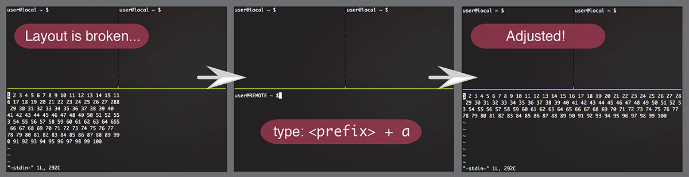

# tmux-adtty

ADjust + TTY: Help to send commands to adjust terminal emulator's column and line size.

<p align="center">

</p>

# Introduction

When a remote terminal device cannot receives your local's terminal emulator's screen size, the layout would be broken.
If any servers does not convey a terminal information in ssh connection, this the issue can be happened. This plugin helps tmux users to fix such the issue.

## Key binding

* `prefix + a` - Adjust terminal emulator's column and line size properly.
  + Send two commands `$ stty rows #{pane_height} cols #{pane_width}` and `clear`.
  + See [Change key binding](#change-default-bind-key) to change this key binding.

## Installation with [Tmux Plugin Manager](https://github.com/tmux-plugins/tpm) (recommended)

Add plugin to the list of TPM plugins in `.tmux.conf`.

```
set -g @plugin 'greymd/tmux-adtty'
```

Hit `prefix + I` to fetch the plugin and source it. You should now be able to use the plugin.

## Manual installation

```
$ git clone https://github.com/greymd/tmux-adtty.git ~/clone/path
```

Add this line to the bottom of `.tmux.conf`.

```
run-shell ~/clone/path/adtty.tmux
```

Reload TMUX environment.

```
$ tmux source-file ~/.tmux.conf
```

## Change default bind key.

Update `@adtty` in `tmux.conf` with such the statement.

```
# Example: Change key binding to 'prefix + A' key.
set -g @adtty 'A'
```


## LICENSE

This is available as open source under the terms of the [MIT License](http://opensource.org/licenses/MIT).
